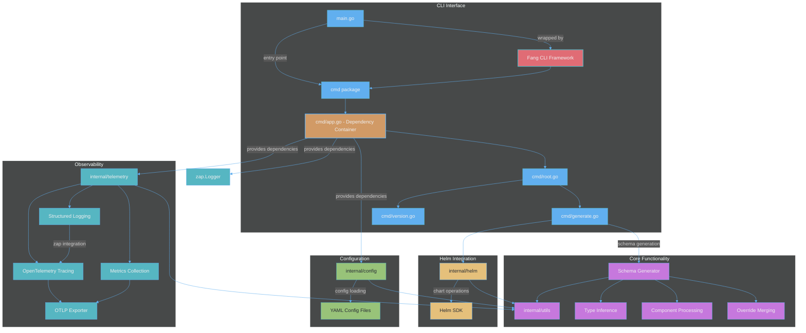

# Valet: Helm Values to JSON Schema


## Fast. Flexible. Clean. Beautiful.

[](https://github.com/mkm29/valet/actions/workflows/release.yml)
[](https://github.com/mkm29/valet/actions/workflows/coverage.yml)
[](https://github.com/mkm29/valet/actions/workflows/coverage.yml)

A command-line tool to generate a JSON Schema from a YAML `values.yaml` file, optionally merging an overrides file. Useful for Helm chart values and other YAML-based configurations.

## Table of Contents

- [Valet: Helm Values to JSON Schema](#valet-helm-values-to-json-schema)
  - [Fast. Flexible. Clean. Beautiful.](#fast-flexible-clean-beautiful)
  - [Table of Contents](#table-of-contents)
  - [Overview](#overview)
  - [Architecture](#architecture)
    - [Package Design](#package-design)
      - [internal/config](#internalconfig)
      - [internal/helm](#internalhelm)
      - [internal/telemetry](#internaltelemetry)
      - [internal/utils](#internalutils)
    - [Architectural Benefits](#architectural-benefits)
    - [Code Quality](#code-quality)
    - [Logging](#logging)
  - [Installation](#installation)
    - [From Source](#from-source)
    - [Using Go Install](#using-go-install)
    - [Using Docker](#using-docker)
  - [Usage](#usage)
    - [Configuration](#configuration)
    - [Examples](#examples)
    - [Example](#example)
    - [Debug Mode](#debug-mode)
    - [Observability](#observability)
  - [How it works](#how-it-works)
    - [Schema Generation Intelligence](#schema-generation-intelligence)
  - [Development](#development)
    - [Requirements](#requirements)
    - [Code Architecture](#code-architecture)
      - [Dependency Injection](#dependency-injection)
      - [Code Organization Principles](#code-organization-principles)
    - [Makefile](#makefile)
    - [Testing \& Coverage](#testing--coverage)
      - [Test Organization](#test-organization)
      - [Known Test Environment Considerations](#known-test-environment-considerations)
    - [Release](#release)
  - [Security](#security)
    - [Sensitive Information Handling](#sensitive-information-handling)
    - [Container Security](#container-security)
  - [Contributing](#contributing)
  - [Roadmap](#roadmap)
    - [✅ Completed Features](#-completed-features)
      - [Core Functionality](#core-functionality)
      - [Remote Helm Chart Support](#remote-helm-chart-support)
      - [Observability \& Monitoring](#observability--monitoring)
      - [Code Quality \& Architecture](#code-quality--architecture)
      - [Developer Experience](#developer-experience)
    - [🚧 In Progress](#-in-progress)
    - [📋 Planned Features](#-planned-features)
      - [Short-term (Q3-Q4 2025)](#short-term-q3-q4-2025)
      - [Medium-term (Q4 2025 - Q1 2026)](#medium-term-q4-2025---q1-2026)
      - [Long-term (2026 and beyond)](#long-term-2026-and-beyond)
    - [🤝 Get Involved](#-get-involved)

## Overview

Valet automatically generates JSON Schema definitions from Helm chart `values.yaml` files:

- **Infers types** from YAML values
- **Preserves defaults** from your values files
- **Handles components** with enabled flags intelligently
- **Supports overrides** via separate YAML files
- **Remote chart support** for downloading schemas from any Helm registry
- **Clean architecture** with DRY code and consistent patterns
- **Comprehensive observability** with OpenTelemetry integration
- **Beautiful CLI experience** powered by [Charm](https://charm.sh/)'s [Fang](https://github.com/charmbracelet/fang) library

## Architecture



### Package Design

Valet follows Go best practices with well-structured packages using a consistent Options pattern:

#### internal/config

- Centralized configuration management
- All configuration structs (including Helm configuration)
- YAML marshaling/unmarshaling support
- Default values and validation
- Constructor functions for each configuration type

#### internal/helm

- Helm chart operations with clean, DRY code
- Struct-based design with `Helm` type and `NewHelm` constructor
- Flexible initialization via `HelmOptions` pattern
- Named logger for better debugging (`helm`)
- Core methods:
  - `HasSchema`: Checks if a remote chart contains values.schema.json
  - `DownloadSchema`: Downloads and saves the schema file
  - `loadChart`: Private method that centralizes chart loading logic
  - `getOrLoadChart`: Private method that implements chart caching
- Features:
  - Support for HTTP, HTTPS, and OCI registries
  - Authentication support (basic auth, token)
  - TLS configuration options
  - **Chart caching**: Downloaded charts are cached in memory to avoid redundant network calls
  - **Size limits**: Charts exceeding the configured size limit (default 1MB) are rejected to prevent memory issues
  - **LRU eviction**: Prevents unbounded memory growth with configurable cache limits
  - **Cache monitoring**: Track hit rates, evictions, and usage statistics
  - **Metadata caching**: Separate cache for chart metadata enabling fast `HasSchema` checks without loading full charts
  - **Dual-cache architecture**: Chart cache for full data, metadata cache for quick lookups
  - **Enhanced error messages**: Detailed troubleshooting hints for common remote chart issues
  - Thread-safe concurrent access with read-write locks
  - Comprehensive debug logging including cache hit/miss, size information, and eviction events
- Cache features:
  - Maximum cache size limit (default: 10MB)
  - Maximum number of cached entries (default: 50)
  - Automatic eviction of least recently used entries
  - Charts larger than the total cache size are not cached
  - Statistics tracking: hits, misses, evictions, hit rate
  - Metadata cache capacity is 2x chart cache for better hit rates
  - Independent LRU eviction for both caches
- Error handling features:
  - Context-aware error messages with troubleshooting hints
  - Registry-specific guidance (HTTP/HTTPS/OCI)
  - Authentication configuration validation with clear feedback
  - Network connectivity and URL format troubleshooting
  - Helpful suggestions when charts lack schema files
- Example usage:

  ```go
  // Using options pattern with custom limits
  h := helm.NewHelm(helm.HelmOptions{
      Debug:           true,  // For HelmOptions, this remains a boolean
      Logger:          customLogger,         // optional
      MaxChartSize:    5 * 1024 * 1024,     // 5MB limit per chart (default is 1MB)
      MaxCacheSize:    20 * 1024 * 1024,    // 20MB total cache (default is 10MB)
      MaxCacheEntries: 100,                 // Max 100 charts cached (default is 50)
  })

  // Get cache statistics
  stats := h.GetCacheStats()
  fmt.Printf("Cache hit rate: %.2f%%, Usage: %.2f%%\n", 
      stats.HitRate, stats.UsagePercent)
  fmt.Printf("Metadata cache hit rate: %.2f%%, Entries: %d\n",
      stats.MetadataHitRate, stats.MetadataEntries)

  // Clear cache if needed
  h.ClearCache()

  // Check and download schema (uses cache automatically)
  if hasSchema, err := h.HasSchema(chartConfig); hasSchema {
      schemaPath, cleanup, err := h.DownloadSchema(chartConfig)
      defer cleanup() // Clean up temporary file
  }
  ```

#### internal/telemetry

- OpenTelemetry integration
- Struct-based design with `Telemetry` type and `NewTelemetry` constructor
- Flexible initialization via `TelemetryOptions` pattern
- Structured logging with zap
- Metrics and tracing support
- Configurable exporters (OTLP, stdout)
- Example usage:

  ```go
  // Using options pattern
  tel := telemetry.NewTelemetry(ctx, telemetry.TelemetryOptions{
      Config: cfg,
  })
  ```

#### internal/utils

- Centralized utility functions for common operations
- Organized into focused modules:
  - `reflection.go`: Reflection utilities for struct field extraction and empty value detection
    - `GetFieldInt`, `GetFieldInt64`, `GetFieldFloat64`: Extract typed values from reflect.Value
    - `IsEmptyValue`: Check if a value is empty (nil, empty string/slice/map)
  - `schema.go`: Schema generation helper functions
    - `BuildNestedDefaults`, `BuildObjectDefaults`: Build default values for schemas
    - `IsNullValue`, `IsDisabledComponent`: Check value states
    - `CountSchemaFields`: Recursively count schema fields
  - `yaml.go`: YAML processing utilities
    - `DeepMerge`: Recursively merge YAML maps
    - `ConvertToStringKeyMap`: Convert interface{} maps to string-keyed maps
    - `LoadYAML`: Load and parse YAML files with proper type conversion
  - `string.go`: String manipulation utilities
    - `MaskString`: Mask sensitive values for logging
    - `SanitizePath`: Remove sensitive path information
    - `FormatBytes`: Convert bytes to human-readable format (KB, MB, GB, etc.)
  - `build.go`: Build information utilities
    - `GetBuildVersion`: Extract version information from the binary
  - `error.go`: Error handling utilities
    - `ErrorType`: Returns a simplified error type for metrics
    - `IsIgnorableSyncError`: Checks if file sync errors should be ignored
  - `math.go`: Mathematical utilities
    - `CalculateDelta`: Calculate delta with counter reset detection
  - `performance.go`: Performance and state utilities
    - `CategorizePerformance`: Categorize performance based on duration
    - `ServerStateToString`: Convert numeric server state to string representation
- All functions are exported and reusable across packages
- Provides consistent utilities for telemetry, monitoring, and general operations

### Architectural Benefits

The consistent Options pattern across packages provides:

- **Flexibility**: Easy to add new configuration options without breaking existing code
- **Testability**: Simple to mock dependencies and inject test configurations
- **Consistency**: All packages follow the same initialization patterns
- **Extensibility**: Options structs can grow with new fields as needed
- **Type Safety**: Compile-time checking of configuration options

### Code Quality

Valet maintains high code quality standards through:

- **Single Responsibility Principle**: Each function does one thing well
  - Complex functions are broken down into smaller, focused units
  - Example: `inferSchema` was refactored from 290+ lines into ~20 focused functions
- **Dependency Injection**: No hidden global state
  - All dependencies are explicitly passed through the `App` struct
  - Makes unit testing straightforward with mock dependencies
- **Clear Separation of Concerns**:
  - Configuration parsing separate from validation
  - Business logic separate from CLI handling
  - Each package has a well-defined responsibility
- **Comprehensive Test Coverage**:
  - 85%+ total test coverage
  - All critical paths thoroughly tested
  - Tests use dependency injection for isolation

### Logging

Valet uses [Uber's zap](https://github.com/uber-go/zap) throughout for high-performance structured logging:

- **Named loggers**: Each package has its own named logger (e.g., `helm`, `telemetry`)
- **Structured fields**: All log data uses typed fields for consistency
- **Level control**: Debug logs only shown when debug mode is enabled
- **Integration**: Logs include trace/span IDs when telemetry is enabled
- **Performance**: Zero-allocation logging in hot paths
- **Automatic flushing**: Logger buffers are automatically flushed on program exit to prevent log loss

## Installation

### From Source

Clone the repository and build:

```bash
git clone https://github.com/mkm29/valet.git
cd valet
go build -o bin/valet main.go
```

### Using Go Install

Install directly using Go modules:

```bash
go install github.com/mkm29/valet@latest
```

### Using Docker

Run Valet using the official Docker image based on Chainguard's distroless static image:

```bash
# Build the image
docker build -t valet:latest .

# Run with mounted values.yaml
docker run --rm -v $(pwd):/data:ro -v $(pwd)/output:/output \
  valet:latest generate --output /output/values.schema.json

# Or use docker-compose
docker-compose run --rm valet
```

The Docker image:

- Uses a minimal distroless base image for security
- Runs as non-root user (UID 65532)
- Contains only the static binary and essential files (CA certificates, timezone data)
- Supports all Valet features including remote chart downloads and telemetry

## Usage

Generate a JSON Schema from a `values.yaml` using the `generate` command:

```console
valet [global options] generate [flags] [context-dir]

Global options:
  --config-file string          config file path (default: .valet.yaml)
  -l, --log-level string        log level (debug, info, warn, error, dpanic, panic, fatal) (default: info)
  --telemetry-enabled           enable telemetry
  --telemetry-exporter string   telemetry exporter type (none, stdout, otlp) (default: none)
  --telemetry-endpoint string   OTLP endpoint for telemetry (default: localhost:4317)
  --telemetry-insecure          use insecure connection for OTLP (default: false)
  --telemetry-sample-rate float trace sampling rate (0.0 to 1.0) (default: 1.0)

Generate flags:
  -f, --overrides string   path (relative to context dir) to an overrides YAML file (optional)
  -o, --output string      output file (default: values.schema.json)

Remote chart flags:
  --chart-name string            name of the remote Helm chart
  --chart-version string         version of the remote Helm chart
  --registry-url string          URL of the Helm chart registry
  --registry-type string         type of registry (HTTP, HTTPS, OCI) (default: HTTPS)
  --registry-insecure            allow insecure connections to the registry
  --registry-username string     username for registry authentication
  --registry-password string     password for registry authentication
  --registry-token string        token for registry authentication
  --registry-tls-skip-verify     skip TLS certificate verification
  --registry-cert-file string    path to client certificate file
  --registry-key-file string     path to client key file
  --registry-ca-file string      path to CA certificate file
```

The tool can generate schemas from:

- **Local Helm charts**: Provide a context directory containing `values.yaml` (defaults to current directory if not specified)
- **Remote Helm charts**: Use `--chart-name` and related flags, or configure in a config file

The tool writes a `values.schema.json` (or custom output file) in the context directory for local charts, or the current directory for remote charts.

### Configuration

Valet supports configuration through multiple sources (in order of precedence):

1. **CLI flags** (highest priority)
2. **Environment variables** (`VALET_CONTEXT`, `VALET_OVERRIDES`, `VALET_OUTPUT`, `VALET_DEBUG`)
3. **Configuration file** (`.valet.yaml` or `--config-file`)
4. **Default values**

Create a `.valet.yaml` file based on [.valet.yaml.example](.valet.yaml.example):

```yaml
logLevel: info
context: .
output: values.schema.json

telemetry:
  enabled: true
  exporterType: otlp
  otlpEndpoint: localhost:4317
  metrics:
    enabled: true
    port: 9090

helm:
  chart:
    name: prometheus
    version: 25.27.0
    registry:
      url: https://prometheus-community.github.io/helm-charts
```

For complete configuration options and examples, see the [examples directory](examples/README.md).

### Examples

Generate schema from a directory containing `values.yaml`:

```bash
./bin/valet generate charts/mychart
```

Generate schema from the current directory (if it contains `values.yaml`):

```bash
./bin/valet generate
```

Generate schema merging an override file:

```bash
./bin/valet generate --overrides override.yaml charts/mychart
```

Generate schema from a remote Helm chart:

```bash
# Using CLI flags
./bin/valet generate --chart-name postgresql --chart-version 12.1.9 \
  --registry-url https://charts.bitnami.com/bitnami .

# Using configuration file
./bin/valet generate --config-file helm-config.yaml .

# With authentication for private registries
./bin/valet generate --chart-name my-chart --chart-version 1.0.0 \
  --registry-url https://private.registry.com/charts \
  --registry-username myuser --registry-password mypass .

# With OCI registry
./bin/valet generate --chart-name my-chart --chart-version 1.0.0 \
  --registry-url oci://registry.example.com/charts \
  --registry-type OCI .
```

Print version/build information:

```bash
./bin/valet version
```

### Example

Given this `values.yaml`:

```yaml
replicaCount: 3
image:
  repository: nginx
  tag: stable
```

Running `valet generate` produces `values.schema.json`:

```json
{
  "$schema": "http://json-schema.org/schema#",
  "type": "object",
  "properties": {
    "replicaCount": {
      "type": "integer",
      "default": 3
    },
    "image": {
      "type": "object",
      "properties": {
        "repository": {
          "type": "string",
          "default": "nginx"
        },
        "tag": {
          "type": "string",
          "default": "stable"
        }
      }
    }
  }
}
```

### Debug Mode

When debug log level is enabled (`--log-level debug` flag or `logLevel: debug` in config), Valet provides:

- Pretty-printed configuration output to stdout (with sensitive fields redacted)
- Detailed debug logging from all components
- Verbose Helm operations logging
- Human-readable console output format

**Security Note**: Registry credentials and authentication tokens are automatically redacted as `[REDACTED]` in debug output to prevent accidental exposure of sensitive information.

Example:

```bash
./bin/valet generate --config-file examples/helm-config.yaml --log-level debug
```

### Observability

Valet includes comprehensive observability features powered by OpenTelemetry:

- **Distributed Tracing**: Track command execution, file operations, and schema generation
- **Metrics Collection**: Command performance, cache statistics, and error rates
- **Structured Logging**: All logs include trace context for correlation
- **Prometheus Endpoint**: Expose metrics at `/metrics` for monitoring

Enable telemetry:

```bash
# Via CLI flags
valet generate --telemetry-enabled --telemetry-exporter otlp \
  --telemetry-endpoint localhost:4317 .

# Via configuration
telemetry:
  enabled: true
  exporterType: otlp
  otlpEndpoint: localhost:4317
  metrics:
    enabled: true
    port: 9090
```

For complete observability documentation including:

- Prometheus alerting rules
- Grafana dashboards
- Docker Compose setup
- Metrics reference

See the [examples directory](examples/README.md#monitoring-and-observability).


## How it works

1. Load configuration from the file specified by `--config-file` (default: `.valet.yaml`), environment variables, and CLI flags
2. Load `values.yaml` in the specified directory
3. Merge an overrides YAML if the `--overrides` flag is provided
4. Recursively infer JSON Schema types and defaults
5. Post-process the schema to intelligently handle:
   - Components with `enabled: false` field (skipping required fields)
   - Empty default values (strings, arrays, maps)
   - Nested component structures
6. Write `values.schema.json` (or custom output file) in the same directory

### Schema Generation Intelligence

The tool includes several smart features:

- **Component detection**: Automatically detects components with an `enabled` field and handles their required fields intelligently 
- **Empty value handling**: Fields with empty default values aren't marked as required
- **Type conversion**: Maps and complex types are properly represented in the schema
- **Nested processing**: Recursively processes properties at all levels of nesting

## Development

### Requirements

- Go 1.23 or later

### Code Architecture

When contributing to Valet, please follow these architectural patterns:

#### Dependency Injection

Valet uses dependency injection for better testability and maintainability:

1. **App Structure**: The `cmd.App` struct holds all application dependencies:

   ```go
   type App struct {
       Config    *config.Config
       Telemetry *telemetry.Telemetry
       Logger    *zap.Logger
   }
   ```

2. **WithApp Pattern**: All commands support dependency injection:

   ```go
   // With dependency injection (preferred for testing)
   app := cmd.NewApp().
       WithConfig(cfg).
       WithTelemetry(tel).
       WithLogger(logger)
   rootCmd := cmd.NewRootCmdWithApp(app)
   ```

3. **Logger Initialization**: The App struct includes a method to initialize the logger based on log level:

   ```go
   // Initialize logger internally based on configuration
   app := cmd.NewApp().WithConfig(cfg)
   cleanup, err := app.InitializeLogger(cfg.LogLevel)
   if err != nil {
       // handle error
   }
   defer cleanup() // Ensures buffered logs are flushed
   ```

4. **Benefits**:
   - Easy unit testing with mock dependencies
   - Clear dependency relationships
   - No hidden global state
   - Better code organization

#### Code Organization Principles

When contributing to Valet, please follow these architectural patterns:

1. **Package Structure**: Each package should have:
   - A main struct type (e.g., `Helm`, `Telemetry`)
   - Clear separation of concerns between packages

2. **Utils Package**: The `internal/utils` package contains shared utility functions organized by domain:
   - `schema.go`: Schema generation utilities (`InferBooleanSchema`, `InferArraySchema`, etc.)
   - `yaml.go`: YAML processing functions (`DeepMerge`, `LoadYAML`)
   - `string.go`: String manipulation utilities (`MaskString`, `FormatBytes`)
   - `reflection.go`: Reflection helpers for struct field extraction
   - `build.go`: Build information utilities (`GetBuildVersion`)

3. **Command Package Organization**: The `cmd` package focuses on CLI orchestration:
   - Command setup and flag management
   - Dependency injection through the `App` struct
   - Minimal business logic (delegated to internal packages)
   - Command-specific helpers remain in `schema_helpers.go`

4. **Helm Package**: The `internal/helm` package handles all Helm-related functionality:
   - Chart downloading and caching
   - Schema extraction from charts
   - Configuration building from CLI flags (`config_builder.go`)
   - An Options struct for configuration (e.g., `HelmOptions`, `TelemetryOptions`)
   - A primary constructor `New<Package>(opts <Package>Options)`
   - Convenience constructors for common use cases
   - Methods on the struct rather than standalone functions

5. **Code Organization**:
   - Follow DRY (Don't Repeat Yourself) principle
   - Extract common logic into private helper methods
   - Keep public methods focused on their primary responsibility
   - Use clear, descriptive method names
   - Apply Single Responsibility Principle - each function should do one thing well
   - Break complex functions into smaller, testable units

6. **Logging**: Use zap with named loggers:

   ```go
   logger := zap.L().Named("packagename")
   ```

7. **Configuration**: All configuration structs belong in `internal/config`

8. **Error Handling**:
   - Wrap errors with context using `fmt.Errorf`
   - Provide meaningful error messages
   - Handle errors at the appropriate level

### Makefile

A Makefile is provided with common development tasks:

- `make help`: Show available commands (default when running `make`).
- `make build`: Build the CLI (outputs `bin/valet`).
- `make test`: Run tests, generate `cover.out` and `cover.html`.
- `make check-coverage`: Install and run `go-test-coverage` to enforce coverage thresholds defined in `.testcoverage.yml`.
- `make clean`: Remove build artifacts (`bin/` and `valet`).

Make sure you have [GNU Make](https://www.gnu.org/software/make/) installed.

### Testing & Coverage

The project uses [Testify](https://github.com/stretchr/testify) as its testing framework, with all tests organized in the `tests` directory using the `ValetTestSuite` test suite.

You can use the Makefile to run tests and check coverage:

```bash
make test
make check-coverage
```

To run the test suite:

```bash
go test ./...
```

To run tests with verbose output:

```bash
go test ./tests/... -v
```

To generate a coverage report:

```bash
go test -coverprofile=coverage.out ./...
go tool cover -func=coverage.out
```

To view an HTML coverage report:

```bash
go tool cover -html=coverage.out
```

#### Test Organization

All tests are located in the `tests` directory and use the `ValetTestSuite` as the base test suite which provides:

- Setup and teardown functionality
- Helper methods like `CopyDir` for test fixtures
- Consistent assertion methods via Testify

Test structure:

- All test files belong to the `tests` package
- Tests either embed `ValetTestSuite` directly or use specialized suites that embed it
- Specialized test suites (e.g., `HelmTestSuite`, `ConfigValidationTestSuite`) provide domain-specific test helpers
- Tests follow testify/suite patterns for better organization and reusability

#### Known Test Environment Considerations

- **Logger Sync**: The telemetry package includes special handling for logger sync errors that commonly occur in test environments when stdout/stderr are redirected or closed. These harmless errors are automatically filtered out to prevent spurious test failures.

The project maintains high test coverage standards:

- 70% minimum coverage for each file
- 80% minimum coverage for each package
- 85% minimum total coverage

These thresholds are enforced in CI via the coverage workflow.

### Release

This project uses [GoReleaser](https://goreleaser.com) to automate builds and releases. Binaries for Linux and macOS (amd64 and arm64) are built when tags (e.g., `v0.1.0`) are pushed.

- A GitHub Actions workflow (`.github/workflows/release.yml`) runs GoReleaser on push tags and via manual dispatch.
- **Note**: The release workflow sets `permissions.contents: write` so that the `GITHUB_TOKEN` has sufficient permissions to create releases.
- To run a local release:

  ```bash
  go install github.com/goreleaser/goreleaser@latest
  goreleaser release --rm-dist
  ```

## Security

### Sensitive Information Handling

Valet takes security seriously when handling sensitive configuration:

- **Registry Credentials**: When using `--registry-username`, `--registry-password`, or `--registry-token`, these values are automatically redacted as `[REDACTED]` in all log output
- **Debug Mode**: Configuration output in debug log level automatically redacts sensitive fields to prevent accidental exposure
- **TLS Certificates**: Certificate file paths are logged, but certificate contents are never exposed
- **Environment Variables**: Sensitive values can be provided via environment variables instead of command-line flags for better security

### Container Security

The Docker image is built with security best practices:

- **Distroless Base**: Uses Chainguard's static image, containing only the application binary and essential files
- **Non-root User**: Runs as user 65532 (nonroot) by default
- **Read-only Filesystem**: Designed to work with read-only root filesystem
- **No Shell**: No shell or package manager in the final image
- **Minimal Attack Surface**: Only includes CA certificates and timezone data beyond the binary
- **Security Options**: Example docker-compose.yaml includes security hardening:
  - `no-new-privileges:true`
  - `read_only: true`
  - All capabilities dropped
  - Temporary filesystems for any required write operations

**Best Practices**:

- Store sensitive credentials in environment variables or secure secret management systems
- Use `--registry-token` with CI/CD service tokens instead of username/password when possible
- Enable TLS verification (`--registry-tls-skip-verify=false`) in production environments
- Review debug logs before sharing to ensure no sensitive data is exposed
- Run containers with minimal privileges and read-only filesystems
- Use volume mounts for input/output rather than building files into the image

## Contributing

Contributions are welcome! Feel free to open issues and submit pull requests.

## Roadmap

Our development roadmap reflects our commitment to making Valet the most powerful and user-friendly tool for Helm schema generation. We welcome community feedback and contributions!

### ✅ Completed Features

#### Core Functionality

- [x] Core schema generation from `values.yaml`
- [x] Type inference with intelligent defaults
- [x] Override file support for configuration merging
- [x] Component detection with `enabled` flag handling
- [x] Beautiful CLI experience with Fang
- [x] Multiple configuration sources (CLI, env vars, config file)
- [x] Cross-platform support (Linux, macOS, Windows)

#### Remote Helm Chart Support

- [x] **Complete Remote Chart Integration**
  - [x] Authentication to private Helm registries (Basic Auth, Token Auth)
  - [x] Retrieve values.yaml from remote charts (HTTP/HTTPS/OCI)
  - [x] Support for OCI registry authentication and retrieval
  - [x] Generate schemas directly from remote charts
  - [x] Advanced LRU caching system for remote charts
  - [x] Configurable cache size limits and eviction policies
  - [x] Thread-safe chart caching with metadata optimization
  - [x] TLS configuration support for secure connections

#### Observability & Monitoring

- [x] **Comprehensive OpenTelemetry Integration**
  - [x] Distributed tracing for all operations
  - [x] Structured logging with Uber Zap
  - [x] Telemetry-independent logging system
  - [x] Context-aware metrics recording
  - [x] File path sanitization for security

- [x] **Prometheus Metrics Endpoint**
  - [x] `/metrics` endpoint with comprehensive metrics
  - [x] Helm cache statistics (hits, misses, evictions, hit rate)
  - [x] Command execution metrics (duration, errors, counts)
  - [x] Schema generation metrics (field counts, timing)
  - [x] File operation metrics with size histograms
  - [x] Health check endpoint for monitoring
  - [x] **Performance optimizations**: Interface-based metrics collection for optimal performance
  - [x] **Counter reset detection**: Graceful handling of cache clearing and counter resets
  - [x] **Configurable health checks**: Tunable startup timing and backoff strategies
  - [x] **Enhanced trace correlation**: Context-aware metrics with automatic span attributes

#### Code Quality & Architecture

- [x] **Clean Architecture & Performance**
  - [x] Dependency injection pattern with App struct
  - [x] Options pattern for flexible package initialization
  - [x] Comprehensive test coverage (>85%)
  - [x] Centralized utility functions in dedicated packages
  - [x] Thread-safe metrics collection
  - [x] High-performance metrics collection with interface-based approach
  - [x] Proper error handling and context propagation

- [x] **Security & Best Practices**
  - [x] Automatic credential redaction in debug output
  - [x] Input validation and sanitization
  - [x] Secure defaults (TLS enabled by default)
  - [x] Path sanitization for telemetry data
  - [x] Configuration validation with security checks

#### Developer Experience

- [x] Automated CI/CD with GitHub Actions
- [x] Comprehensive debugging and logging
- [x] Example configurations and documentation
- [x] Makefile with common development tasks

### 🚧 In Progress

- [ ] **Enhanced Remote Chart Features**
  - [ ] Validate local values against remote chart schemas
  - [ ] Chart dependency resolution and caching

### 📋 Planned Features

#### Short-term (Q3-Q4 2025)

- [ ] **Enhanced Schema Features**
  - [ ] Custom validation rules support
  - [ ] Pattern matching for string fields
  - [ ] Enum detection from comments
  - [ ] Min/max constraints for numeric fields
  - [ ] Required field inference from templates
  - [ ] Advanced schema composition and inheritance

- [ ] **CUE Integration**
  - [ ] See [HIP Draft](https://github.com/helm/helm/issues/13260) for details
  - [ ] Generate CUE schemas from Helm values
  - [ ] Support CUE validation in CLI
  - [ ] CUE-based schema merging and overrides
  - [ ] CUE schema generation from remote charts

#### Medium-term (Q4 2025 - Q1 2026)

- [ ] **Advanced Type System**
  - [ ] Union types support
  - [ ] Conditional schema based on other fields
  - [ ] Reference resolution (`$ref`) support
  - [ ] External schema imports
  - [ ] Schema composition and modularity

- [ ] **Integration Ecosystem**
  - [ ] Kubernetes CRD generation from schema
  - [ ] ArgoCD integration for GitOps workflows
  - [ ] Backstage plugin for documentation
  - [ ] JSON Schema to TypeScript/Go type generation
  - [ ] IDE plugins for VS Code, IntelliJ
  - [ ] Pre-commit hooks for schema validation

#### Long-term (2026 and beyond)

- [ ] **AI-Powered Features**
  - [ ] Smart type inference using ML models
  - [ ] Natural language schema descriptions
  - [ ] Automated documentation generation
  - [ ] Schema optimization suggestions

- [ ] **Enterprise Features**
  - [ ] Schema registry with versioning
  - [ ] Access control and approval workflows
  - [ ] Audit logging for schema changes
  - [ ] Multi-tenant support

- [ ] **Performance & Scale**
  - [ ] Parallel processing for large charts
  - [ ] Incremental schema generation
  - [ ] Distributed caching support
  - [ ] WebAssembly runtime for browser usage

### 🤝 Get Involved

Want to contribute to the roadmap? Here's how:

1. **Vote on features**: Add reactions to [existing issues](https://github.com/mkm29/valet/issues)
2. **Suggest ideas**: Open a [new issue](https://github.com/mkm29/valet/issues/new) with your feature request
3. **Contribute code**: Pick an item from the roadmap and submit a PR
4. **Join discussions**: Participate in [GitHub Discussions](https://github.com/mkm29/valet/discussions)

See the [open issues](https://github.com/mkm29/valet/issues) for a detailed list of proposed features and known issues.
