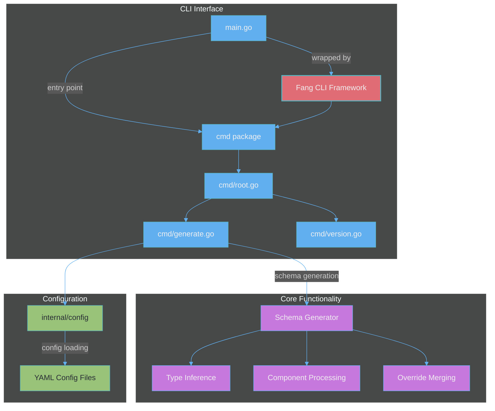

# Valet: Helm Values to JSON Schema


## Fast. Flexible. Clean. Beautiful.

[](https://github.com/mkm29/valet/actions/workflows/release.yml)
[](https://github.com/mkm29/valet/actions/workflows/coverage.yml)

A command-line tool to generate a JSON Schema from a YAML `values.yaml` file, optionally merging an overrides file. Useful for Helm chart values and other YAML-based configurations.

## Table of Contents

- [Overview](#overview)
- [Architecture](#architecture)
- [Installation](#installation)
- [Usage](#usage)
  - [Configuration](#configuration)
  - [Examples](#examples)
- [How it works](#how-it-works)
- [Development](#development)
  - [Requirements](#requirements)
  - [Makefile](#makefile)
  - [Testing & Coverage](#testing--coverage)
  - [Release](#release)
- [Contributing](#contributing)

## Overview

Valet automatically generates JSON Schema definitions from Helm chart `values.yaml` files:

- **Infers types** from YAML values
- **Preserves defaults** from your values files
- **Handles components** with enabled flags intelligently
- **Supports overrides** via separate YAML files
- **Speeds up development** by providing schema validation for Helm charts
- **Beautiful CLI experience** powered by [Charm](https://charm.sh/)'s [Fang](https://github.com/charmbracelet/fang) library

## Architecture



## Installation

### From Source

Clone the repository and build:

```bash
git clone https://github.com/mkm29/valet.git
cd valet
go build -o bin/valet main.go
```

### Using Go Install

Install directly using Go modules:

```bash
go install github.com/mkm29/valet@latest
```

## Usage

Generate a JSON Schema from a `values.yaml` in the given `<context-dir>` using the `generate` command:

```console
valet [global options] generate [flags] <context-dir>

Global options:
  --config-file string   config file path (default: .valet.yaml)
  -d, --debug            enable debug logging

Generate flags:
  -f, --overrides string   path (relative to context dir) to an overrides YAML file (optional)
  -o, --output string      output file (default: values.schema.json)
```

The tool writes a `values.schema.json` (or custom output file) in the `<context-dir>`.

### Configuration

Valet supports configuration through multiple sources, with precedence in the following order:
1. CLI flags (highest priority)
2. Environment variables
3. Configuration file
4. Default values (lowest priority)

#### Configuration File

The CLI supports a YAML configuration file (default: `.valet.yaml`) in the current directory. Use the `--config-file` flag to specify a custom path. The following keys are supported:

- `context`: directory containing `values.yaml`
- `overrides`: path to an overrides YAML file
- `output`: name of the output schema file (default: `values.schema.json`)
- `debug`: enable debug logging (boolean)

#### Environment Variables

Configuration can also be set via environment variables:
- `VALET_CONTEXT`
- `VALET_OVERRIDES`
- `VALET_OUTPUT`
- `VALET_DEBUG`

### Examples

Generate schema from a directory containing `values.yaml`:

```bash
./bin/valet generate charts/mychart
```

Generate schema merging an override file:

```bash
./bin/valet generate --overrides override.yaml charts/mychart
```

Print version/build information:

```bash
./bin/valet version
```

Output format:

```text
github.com/mkm29/valet@v0.1.1 (commit 9153c14b9ffddeaccba93268a0851d5da0ae8cbf)
```

#### Example Input/Output

Given a `values.yaml`:

```yaml
replicaCount: 3
image:
  repository: nginx
  tag: stable
env:
  - name: LOG_LEVEL
    value: debug
```

Running the `generate` command:

```bash
./bin/valet generate .
```

Produces `values.schema.json` with contents:

```json
{
  "$schema": "http://json-schema.org/schema#",
  "type": "object",
  "properties": {
    "replicaCount": {
      "type": "integer",
      "default": 3
    },
    "image": {
      "type": "object",
      "properties": {
        "repository": {
          "type": "string",
          "default": "nginx"
        },
        "tag": {
          "type": "string",
          "default": "stable"
        }
      },
      "default": {}
    },
    "env": {
      "type": "array",
      "items": {
        "type": "object",
        "properties": {
          "name": {
            "type": "string",
            "default": "LOG_LEVEL"
          },
          "value": {
            "type": "string",
            "default": "debug"
          }
        },
        "default": {}
      },
      "default": []
    }
  },
  "required": ["replicaCount", "image", "env"]
}
```

## How it works

1. Load configuration from the file specified by `--config-file` (default: `.valet.yaml`), environment variables, and CLI flags
2. Load `values.yaml` in the specified directory
3. Merge an overrides YAML if the `--overrides` flag is provided
4. Recursively infer JSON Schema types and defaults
5. Post-process the schema to intelligently handle:
   - Components with `enabled: false` field (skipping required fields)
   - Empty default values (strings, arrays, maps)
   - Nested component structures
6. Write `values.schema.json` (or custom output file) in the same directory

### Schema Generation Intelligence

The tool includes several smart features:

- **Component detection**: Automatically detects components with an `enabled` field and handles their required fields intelligently 
- **Empty value handling**: Fields with empty default values aren't marked as required
- **Type conversion**: Maps and complex types are properly represented in the schema
- **Nested processing**: Recursively processes properties at all levels of nesting

## Development

### Requirements

- Go 1.23 or later

### Makefile

A Makefile is provided with common development tasks:

- `make help`: Show available commands (default when running `make`).
- `make build`: Build the CLI (outputs `bin/valet`).
- `make test`: Run tests, generate `cover.out` and `cover.html`.
- `make check-coverage`: Install and run `go-test-coverage` to enforce coverage thresholds defined in `.testcoverage.yml`.
- `make clean`: Remove build artifacts (`bin/` and `valet`).

Make sure you have [GNU Make](https://www.gnu.org/software/make/) installed.

### Testing & Coverage

The project uses [Testify](https://github.com/stretchr/testify) as its testing framework, with all tests organized in the `tests` directory using the `ValetTestSuite` test suite.

You can use the Makefile to run tests and check coverage:

```bash
make test
make check-coverage
```

To run the test suite:

```bash
go test ./...
```

To run tests with verbose output:

```bash
go test ./tests/... -v
```

To generate a coverage report:

```bash
go test -coverprofile=coverage.out ./...
go tool cover -func=coverage.out
```

To view an HTML coverage report:

```bash
go tool cover -html=coverage.out
```

#### Test Organization

All tests are located in the `tests` directory and use the `ValetTestSuite` struct which provides:
- Setup and teardown functionality
- Helper methods like `CopyDir` for test fixtures
- Consistent assertion methods via Testify

The project maintains high test coverage standards:
- 70% minimum coverage for each file
- 80% minimum coverage for each package
- 85% minimum total coverage

These thresholds are enforced in CI via the coverage workflow.

### Release

This project uses [GoReleaser](https://goreleaser.com) to automate builds and releases. Binaries for Linux and macOS (amd64 and arm64) are built when tags (e.g., `v0.1.0`) are pushed.

- A GitHub Actions workflow (`.github/workflows/release.yml`) runs GoReleaser on push tags and via manual dispatch.
- **Note**: The release workflow sets `permissions.contents: write` so that the `GITHUB_TOKEN` has sufficient permissions to create releases.
- To run a local release:

  ```bash
  go install github.com/goreleaser/goreleaser@latest
  goreleaser release --rm-dist
  ```

## Contributing

Contributions are welcome! Feel free to open issues and submit pull requests.