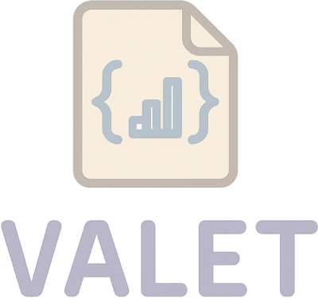
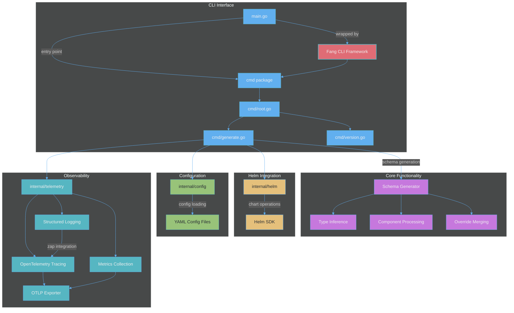

# Valet: Helm Values to JSON Schema



## Fast. Flexible. Clean. Beautiful.

[](https://github.com/mkm29/valet/actions/workflows/release.yml)
[](https://github.com/mkm29/valet/actions/workflows/coverage.yml)

A command-line tool to generate a JSON Schema from a YAML `values.yaml` file, optionally merging an overrides file. Useful for Helm chart values and other YAML-based configurations.

## Table of Contents

- [Valet: Helm Values to JSON Schema](#valet-helm-values-to-json-schema)
  - [Fast. Flexible. Clean. Beautiful.](#fast-flexible-clean-beautiful)
  - [Table of Contents](#table-of-contents)
  - [Overview](#overview)
  - [Architecture](#architecture)
  - [Installation](#installation)
    - [From Source](#from-source)
    - [Using Go Install](#using-go-install)
  - [Usage](#usage)
    - [Configuration](#configuration)
      - [Configuration File](#configuration-file)
      - [Environment Variables](#environment-variables)
    - [Examples](#examples)
    - [Observability](#observability)
      - [Telemetry Configuration](#telemetry-configuration)
      - [Configuration Options](#configuration-options)
      - [Distributed Tracing](#distributed-tracing)
      - [Metrics](#metrics)
      - [Structured Logging](#structured-logging)
      - [Integration with Observability Platforms](#integration-with-observability-platforms)
      - [Example Input/Output](#example-inputoutput)
  - [How it works](#how-it-works)
    - [Schema Generation Intelligence](#schema-generation-intelligence)
  - [Development](#development)
    - [Requirements](#requirements)
    - [Makefile](#makefile)
    - [Testing \& Coverage](#testing--coverage)
      - [Test Organization](#test-organization)
    - [Release](#release)
  - [Contributing](#contributing)
  - [Roadmap](#roadmap)
    - [✅ Completed Features](#-completed-features)
    - [🚧 In Progress](#-in-progress)
    - [📋 Planned Features](#-planned-features)
      - [Short-term (Q2-Q3 2025)](#short-term-q2-q3-2025)
      - [Medium-term (Q3-Q4 2025)](#medium-term-q3-q4-2025)
      - [Long-term (2026 and beyond)](#long-term-2026-and-beyond)
    - [🤝 Get Involved](#-get-involved)

## Overview

Valet automatically generates JSON Schema definitions from Helm chart `values.yaml` files:

- **Infers types** from YAML values
- **Preserves defaults** from your values files
- **Handles components** with enabled flags intelligently
- **Supports overrides** via separate YAML files
- **Speeds up development** by providing schema validation for Helm charts
- **Beautiful CLI experience** powered by [Charm](https://charm.sh/)'s [Fang](https://github.com/charmbracelet/fang) library

## Architecture



### Package Design

Valet follows Go best practices with well-structured packages using a consistent Options pattern:

#### internal/config
- Centralized configuration management
- All configuration structs (including Helm configuration)
- YAML marshaling/unmarshaling support
- Default values and validation
- Constructor functions for each configuration type

#### internal/helm
- Helm chart operations
- Struct-based design with `Helm` type and `NewHelm` constructor
- Flexible initialization via `HelmOptions` pattern
- Named logger for better debugging (`helm`)
- Methods for checking and downloading schemas from remote charts
- Convenience function `NewHelmWithDebug` for simple use cases
- Example usage:
  ```go
  // Using options pattern
  h := helm.NewHelm(helm.HelmOptions{
      Debug:  true,
      Logger: customLogger, // optional
  })
  
  // Using convenience function
  h := helm.NewHelmWithDebug(true)
  ```

#### internal/telemetry
- OpenTelemetry integration
- Struct-based design with `Telemetry` type and `NewTelemetry` constructor
- Flexible initialization via `TelemetryOptions` pattern
- Structured logging with zap
- Metrics and tracing support
- Configurable exporters (OTLP, stdout)
- Convenience function `NewTelemetryWithConfig` for simple use cases
- Backward compatible `Initialize` function
- Example usage:
  ```go
  // Using options pattern
  tel := telemetry.NewTelemetry(ctx, telemetry.TelemetryOptions{
      Config: cfg,
  })
  
  // Using convenience function (or backward compatible Initialize)
  tel := telemetry.NewTelemetryWithConfig(ctx, cfg)
  ```

### Architectural Benefits

The consistent Options pattern across packages provides:

- **Flexibility**: Easy to add new configuration options without breaking existing code
- **Testability**: Simple to mock dependencies and inject test configurations
- **Consistency**: All packages follow the same initialization patterns
- **Extensibility**: Options structs can grow with new fields as needed
- **Type Safety**: Compile-time checking of configuration options

### Logging

Valet uses [Uber's zap](https://github.com/uber-go/zap) throughout for high-performance structured logging:

- **Named loggers**: Each package has its own named logger (e.g., `helm`, `telemetry`)
- **Structured fields**: All log data uses typed fields for consistency
- **Level control**: Debug logs only shown when debug mode is enabled
- **Integration**: Logs include trace/span IDs when telemetry is enabled
- **Performance**: Zero-allocation logging in hot paths

## Installation

### From Source

Clone the repository and build:

```bash
git clone https://github.com/mkm29/valet.git
cd valet
go build -o bin/valet main.go
```

### Using Go Install

Install directly using Go modules:

```bash
go install github.com/mkm29/valet@latest
```

## Usage

Generate a JSON Schema from a `values.yaml` using the `generate` command:

```console
valet [global options] generate [flags] [context-dir]

Global options:
  --config-file string          config file path (default: .valet.yaml)
  -d, --debug                   enable debug logging
  --telemetry-enabled           enable telemetry
  --telemetry-exporter string   telemetry exporter type (none, stdout, otlp) (default: none)
  --telemetry-endpoint string   OTLP endpoint for telemetry (default: localhost:4317)
  --telemetry-insecure          use insecure connection for OTLP (default: false)
  --telemetry-sample-rate float trace sampling rate (0.0 to 1.0) (default: 1.0)

Generate flags:
  -f, --overrides string   path (relative to context dir) to an overrides YAML file (optional)
  -o, --output string      output file (default: values.schema.json)

Remote chart flags:
  --chart-name string            name of the remote Helm chart
  --chart-version string         version of the remote Helm chart
  --registry-url string          URL of the Helm chart registry
  --registry-type string         type of registry (HTTP, HTTPS, OCI) (default: HTTPS)
  --registry-insecure            allow insecure connections to the registry
  --registry-username string     username for registry authentication
  --registry-password string     password for registry authentication
  --registry-token string        token for registry authentication
  --registry-tls-skip-verify     skip TLS certificate verification
  --registry-cert-file string    path to client certificate file
  --registry-key-file string     path to client key file
  --registry-ca-file string      path to CA certificate file
```

The tool can generate schemas from:
- **Local Helm charts**: Provide a context directory containing `values.yaml`
- **Remote Helm charts**: Use `--chart-name` and related flags, or configure in a config file

The tool writes a `values.schema.json` (or custom output file) in the context directory for local charts, or the current directory for remote charts.

### Configuration

Valet supports configuration through multiple sources, with precedence in the following order:

1. CLI flags (highest priority)
2. Environment variables
3. Configuration file
4. Default values (lowest priority)

#### Configuration File

The CLI supports a YAML configuration file (default: `.valet.yaml`) in the current directory. Use the `--config-file` flag to specify a custom path. The following keys are supported:

- `context`: directory containing `values.yaml`
- `overrides`: path to an overrides YAML file
- `output`: name of the output schema file (default: `values.schema.json`)
- `debug`: enable debug logging (boolean)
- `telemetry`: telemetry configuration (object)
  - `enabled`: enable telemetry (boolean)
  - `serviceName`: service name for telemetry (default: `valet`)
  - `serviceVersion`: service version for telemetry (default: `0.1.0`)
  - `exporterType`: type of exporter (`none`, `stdout`, `otlp`)
  - `otlpEndpoint`: OTLP endpoint for traces and metrics
  - `insecure`: use insecure connection for OTLP
  - `sampleRate`: trace sampling rate (0.0 to 1.0)
  - `headers`: additional headers for OTLP requests (map)
- `helm`: Helm chart configuration for remote charts (object)
  - `chart`: chart details (object)
    - `name`: chart name (e.g., `postgresql`)
    - `version`: chart version (e.g., `12.1.9`)
    - `registry`: registry configuration (object)
      - `url`: registry URL (e.g., `https://charts.bitnami.com/bitnami`)
      - `type`: registry type (`HTTP`, `HTTPS`, `OCI`)
      - `insecure`: allow insecure connections
      - `auth`: authentication configuration (object)
        - `username`: username for basic auth
        - `password`: password for basic auth
        - `token`: token for token-based auth
      - `tls`: TLS configuration (object)
        - `insecureSkipTLSVerify`: skip TLS verification
        - `certFile`: path to client certificate
        - `keyFile`: path to client key
        - `caFile`: path to CA certificate

See `examples/helm-config.yaml` for a complete example of working with remote Helm charts.

#### Environment Variables

Configuration can also be set via environment variables:

- `VALET_CONTEXT`
- `VALET_OVERRIDES`
- `VALET_OUTPUT`
- `VALET_DEBUG`

### Examples

Generate schema from a directory containing `values.yaml`:

```bash
./bin/valet generate charts/mychart
```

Generate schema merging an override file:

```bash
./bin/valet generate --overrides override.yaml charts/mychart
```

Generate schema from a remote Helm chart:

```bash
# Using CLI flags
./bin/valet generate --chart-name postgresql --chart-version 12.1.9 \
  --registry-url https://charts.bitnami.com/bitnami .

# Using configuration file
./bin/valet generate --config-file helm-config.yaml .

# With authentication for private registries
./bin/valet generate --chart-name my-chart --chart-version 1.0.0 \
  --registry-url https://private.registry.com/charts \
  --registry-username myuser --registry-password mypass .

# With OCI registry
./bin/valet generate --chart-name my-chart --chart-version 1.0.0 \
  --registry-url oci://registry.example.com/charts \
  --registry-type OCI .
```

Print version/build information:

```bash
./bin/valet version
```

```text
github.com/mkm29/valet@v0.1.1 (commit 9153c14b9ffddeaccba93268a0851d5da0ae8cbf)
```

### Debug Mode

When debug mode is enabled (`--debug` flag or `debug: true` in config), Valet provides:

- Pretty-printed configuration output to stdout
- Detailed debug logging from all components
- Verbose Helm operations logging
- Human-readable console output format

Example:
```bash
./bin/valet generate --config-file examples/helm-config.yaml --debug
```

### Observability

Valet includes comprehensive observability capabilities through OpenTelemetry integration, providing distributed tracing and metrics for monitoring. Logging is always available independent of telemetry settings.

#### Telemetry Configuration

Enable telemetry using CLI flags or configuration:

```bash
# Enable with stdout exporter (for development)
valet generate --telemetry-enabled --telemetry-exporter stdout charts/mychart

# Enable with OTLP exporter (for production)
valet generate --telemetry-enabled --telemetry-exporter otlp \
  --telemetry-endpoint localhost:4317 \
  --telemetry-insecure charts/mychart
```

#### Configuration Options

Telemetry can be configured via:

1. **CLI Flags**:
   - `--telemetry-enabled`: Enable telemetry (default: false)
   - `--telemetry-exporter`: Exporter type: `none`, `stdout`, `otlp` (default: none)
   - `--telemetry-endpoint`: OTLP endpoint (default: localhost:4317)
   - `--telemetry-insecure`: Use insecure connection for OTLP (default: false for better security)
   - `--telemetry-sample-rate`: Trace sampling rate 0.0-1.0 (default: 1.0)

2. **Configuration File** (`.valet.yaml`):

```yaml
telemetry:
  enabled: true
  serviceName: valet
  exporterType: otlp
  otlpEndpoint: localhost:4317
  insecure: false
  sampleRate: 1.0
  headers:
    api-key: your-api-key
```

1. **Environment Variables**:
   - `VALET_TELEMETRY`
   - `VALET_TELEMETRY_EXPORTER`
   - `VALET_TELEMETRY_ENDPOINT`
   - `VALET_TELEMETRY_INSECURE`
   - `VALET_TELEMETRY_SAMPLE_RATE`

#### Distributed Tracing

Valet creates detailed traces for all operations:

- **Command execution**: Root span for the entire command
- **File operations**: Loading values.yaml, overrides, writing schema
- **Schema generation**: Type inference, merging, validation
- **Component processing**: Individual spans for complex operations

Example trace structure:

```bash
generate.command
├── load.values_yaml
├── load.overrides_yaml (if applicable)
├── merge.yaml_files
├── generate.schema
├── marshal.json
└── write.schema_file
```

#### Metrics

The following metrics are collected:

- **Command Metrics**:
  - `valet.command.executions`: Total command executions (counter)
  - `valet.command.duration`: Command execution duration (histogram)
  - `valet.command.errors`: Total command errors (counter)

- **File Operation Metrics**:
  - `valet.file.reads`: File read operations (counter)
  - `valet.file.writes`: File write operations (counter)
  - `valet.file.size`: File size distribution (histogram)

- **Schema Generation Metrics**:
  - `valet.schema.generations`: Total schema generations (counter)
  - `valet.schema.fields`: Number of fields in schemas (histogram)
  - `valet.schema.generation_duration`: Schema generation time (histogram)

All file path attributes in metrics are sanitized to protect sensitive information - only the filename and immediate parent directory are included in telemetry data.

#### Structured Logging

Valet uses [Uber's zap](https://github.com/uber-go/zap) for high-performance structured logging:

- **Always available**: Logging works regardless of telemetry settings
- **Zero-allocation logging**: Zap's design ensures minimal performance overhead
- **Structured fields**: All log data is structured for easy parsing and querying
- **OpenTelemetry integration**: When telemetry is enabled, log entries automatically include trace and span IDs
- **Span events**: When telemetry is enabled, logs are also recorded as events in the active span
- **Level control**: Info level by default, Debug level when `--debug` flag is set
- **Format control**: Development format (human-readable) when debug is enabled, JSON format otherwise

Example log output:

```json
{
  "timestamp": "2024-01-20T10:15:30.123Z",
  "level": "debug",
  "logger": "valet",
  "caller": "generate.go:459",
  "message": "Original YAML values loaded",
  "trace_id": "7d3e8f9a1b2c3d4e5f6a7b8c9d0e1f2a",
  "span_id": "1a2b3c4d5e6f7890",
  "file": "charts/mychart/values.yaml",
  "top_level_keys": 15
}
```

#### Integration with Observability Platforms

Valet's OTLP exporter can send telemetry data to any OpenTelemetry-compatible backend:

- **Jaeger**: For distributed tracing
- **Prometheus**: For metrics collection
- **Grafana**: For visualization
- **Elastic APM**: For application performance monitoring
- **New Relic, Datadog, etc.**: Via OTLP support

Example docker-compose setup for local observability:

```yaml
services:
  otel-collector:
    image: otel/opentelemetry-collector:latest
    ports:
      - "4317:4317"  # OTLP gRPC
      - "4318:4318"  # OTLP HTTP
    volumes:
      - ./otel-config.yaml:/etc/otel-collector-config.yaml
    command: ["--config=/etc/otel-collector-config.yaml"]

  jaeger:
    image: jaegertracing/all-in-one:latest
    ports:
      - "16686:16686"  # Jaeger UI
      - "14250:14250"  # Jaeger gRPC
```

#### Example Input/Output

Given a `values.yaml`:

```yaml
replicaCount: 3
image:
  repository: nginx
  tag: stable
env:
  - name: LOG_LEVEL
    value: debug
```

Running the `generate` command:

```bash
./bin/valet generate .
```

Produces `values.schema.json` with contents:

```json
{
  "$schema": "http://json-schema.org/schema#",
  "type": "object",
  "properties": {
    "replicaCount": {
      "type": "integer",
      "default": 3
    },
    "image": {
      "type": "object",
      "properties": {
        "repository": {
          "type": "string",
          "default": "nginx"
        },
        "tag": {
          "type": "string",
          "default": "stable"
        }
      },
      "default": {}
    },
    "env": {
      "type": "array",
      "items": {
        "type": "object",
        "properties": {
          "name": {
            "type": "string",
            "default": "LOG_LEVEL"
          },
          "value": {
            "type": "string",
            "default": "debug"
          }
        },
        "default": {}
      },
      "default": []
    }
  },
  "required": ["replicaCount", "image", "env"]
}
```

## How it works

1. Load configuration from the file specified by `--config-file` (default: `.valet.yaml`), environment variables, and CLI flags
2. Load `values.yaml` in the specified directory
3. Merge an overrides YAML if the `--overrides` flag is provided
4. Recursively infer JSON Schema types and defaults
5. Post-process the schema to intelligently handle:
   - Components with `enabled: false` field (skipping required fields)
   - Empty default values (strings, arrays, maps)
   - Nested component structures
6. Write `values.schema.json` (or custom output file) in the same directory

### Schema Generation Intelligence

The tool includes several smart features:

- **Component detection**: Automatically detects components with an `enabled` field and handles their required fields intelligently 
- **Empty value handling**: Fields with empty default values aren't marked as required
- **Type conversion**: Maps and complex types are properly represented in the schema
- **Nested processing**: Recursively processes properties at all levels of nesting

## Development

### Requirements

- Go 1.23 or later

### Code Architecture

When contributing to Valet, please follow these architectural patterns:

1. **Package Structure**: Each package should have:
   - A main struct type (e.g., `Helm`, `Telemetry`)
   - An Options struct for configuration (e.g., `HelmOptions`, `TelemetryOptions`)
   - A primary constructor `New<Package>(opts <Package>Options)`
   - Convenience constructors for common use cases
   - Methods on the struct rather than standalone functions

2. **Logging**: Use zap with named loggers:
   ```go
   logger := zap.L().Named("packagename")
   ```

3. **Configuration**: All configuration structs belong in `internal/config`

4. **Error Handling**: Wrap errors with context using `fmt.Errorf`

### Makefile

A Makefile is provided with common development tasks:

- `make help`: Show available commands (default when running `make`).
- `make build`: Build the CLI (outputs `bin/valet`).
- `make test`: Run tests, generate `cover.out` and `cover.html`.
- `make check-coverage`: Install and run `go-test-coverage` to enforce coverage thresholds defined in `.testcoverage.yml`.
- `make clean`: Remove build artifacts (`bin/` and `valet`).

Make sure you have [GNU Make](https://www.gnu.org/software/make/) installed.

### Testing & Coverage

The project uses [Testify](https://github.com/stretchr/testify) as its testing framework, with all tests organized in the `tests` directory using the `ValetTestSuite` test suite.

You can use the Makefile to run tests and check coverage:

```bash
make test
make check-coverage
```

To run the test suite:

```bash
go test ./...
```

To run tests with verbose output:

```bash
go test ./tests/... -v
```

To generate a coverage report:

```bash
go test -coverprofile=coverage.out ./...
go tool cover -func=coverage.out
```

To view an HTML coverage report:

```bash
go tool cover -html=coverage.out
```

#### Test Organization

All tests are located in the `tests` directory and use the `ValetTestSuite` struct which provides:

- Setup and teardown functionality
- Helper methods like `CopyDir` for test fixtures
- Consistent assertion methods via Testify

The project maintains high test coverage standards:

- 70% minimum coverage for each file
- 80% minimum coverage for each package
- 85% minimum total coverage

These thresholds are enforced in CI via the coverage workflow.

### Release

This project uses [GoReleaser](https://goreleaser.com) to automate builds and releases. Binaries for Linux and macOS (amd64 and arm64) are built when tags (e.g., `v0.1.0`) are pushed.

- A GitHub Actions workflow (`.github/workflows/release.yml`) runs GoReleaser on push tags and via manual dispatch.
- **Note**: The release workflow sets `permissions.contents: write` so that the `GITHUB_TOKEN` has sufficient permissions to create releases.
- To run a local release:

  ```bash
  go install github.com/goreleaser/goreleaser@latest
  goreleaser release --rm-dist
  ```

## Contributing

Contributions are welcome! Feel free to open issues and submit pull requests.

## Roadmap

Our development roadmap reflects our commitment to making Valet the most powerful and user-friendly tool for Helm schema generation. We welcome community feedback and contributions!

### ✅ Completed Features

- [x] Core schema generation from `values.yaml`
- [x] Type inference with intelligent defaults
- [x] Override file support for configuration merging
- [x] Component detection with `enabled` flag handling
- [x] Beautiful CLI experience with Fang
- [x] OpenTelemetry integration (tracing, metrics, logging)
- [x] Multiple configuration sources (CLI, env vars, config file)
- [x] Comprehensive test coverage (>85%)
- [x] Automated CI/CD with GitHub Actions
- [x] Cross-platform support (Linux, macOS, Windows)

### 🚧 In Progress

- [ ] **Remote Chart Support** - Work with charts from any registry
  - [ ] Authentication to private Helm registries
  - [ ] Retrieve values.yaml from remote charts (HTTP/HTTPS)
  - [ ] Support for OCI registry authentication and retrieval
  - [ ] Generate schemas directly from remote charts
  - [ ] Validate local values against remote chart schemas
  - [ ] Cache remote charts for offline use

### 📋 Planned Features

#### Short-term (Q2-Q3 2025)

- [ ] **Enhanced Schema Features**
  - [ ] Custom validation rules support
  - [ ] Pattern matching for string fields
  - [ ] Enum detection from comments
  - [ ] Min/max constraints for numeric fields
  - [ ] Required field inference from templates

- [ ] **CUE Integration**
  - [ ] See [HIP Draft](https://github.com/helm/helm/issues/13260) for details
  - [ ] Generate CUE schemas from Helm values
  - [ ] Support CUE validation in CLI
  - [ ] CUE-based schema merging and overrides
  - [ ] CUE schema generation from remote charts

#### Medium-term (Q3-Q4 2025)

- [ ] **Advanced Type System**
  - [ ] Union types support
  - [ ] Conditional schema based on other fields
  - [ ] Reference resolution (`$ref`) support
  - [ ] External schema imports

- [ ] **Integration Ecosystem**
  - [ ] Kubernetes CRD generation from schema
  - [ ] ArgoCD integration for GitOps workflows
  - [ ] Backstage plugin for documentation
  - [ ] JSON Schema to TypeScript/Go type generation

#### Long-term (2026 and beyond)

- [ ] **AI-Powered Features**
  - [ ] Smart type inference using ML models
  - [ ] Natural language schema descriptions
  - [ ] Automated documentation generation
  - [ ] Schema optimization suggestions

- [ ] **Enterprise Features**
  - [ ] Schema registry with versioning
  - [ ] Access control and approval workflows
  - [ ] Audit logging for schema changes
  - [ ] Multi-tenant support

- [ ] **Performance & Scale**
  - [ ] Parallel processing for large charts
  - [ ] Incremental schema generation
  - [ ] Distributed caching support
  - [ ] WebAssembly runtime for browser usage

### 🤝 Get Involved

Want to contribute to the roadmap? Here's how:

1. **Vote on features**: Add reactions to [existing issues](https://github.com/mkm29/valet/issues)
2. **Suggest ideas**: Open a [new issue](https://github.com/mkm29/valet/issues/new) with your feature request
3. **Contribute code**: Pick an item from the roadmap and submit a PR
4. **Join discussions**: Participate in [GitHub Discussions](https://github.com/mkm29/valet/discussions)

See the [open issues](https://github.com/mkm29/valet/issues) for a detailed list of proposed features and known issues.